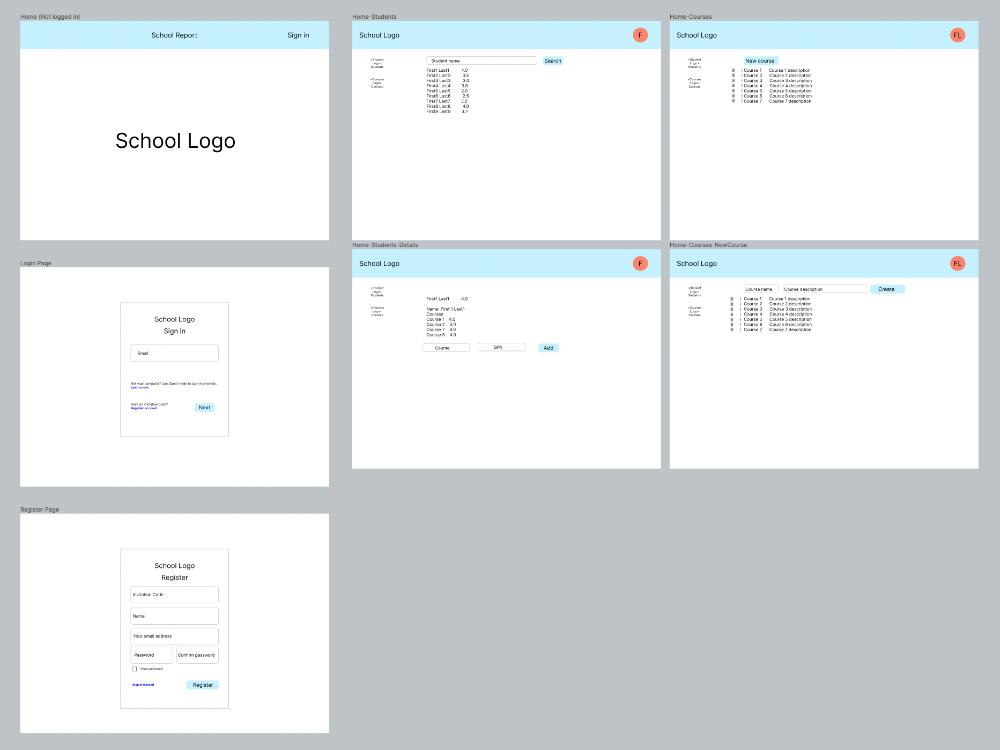
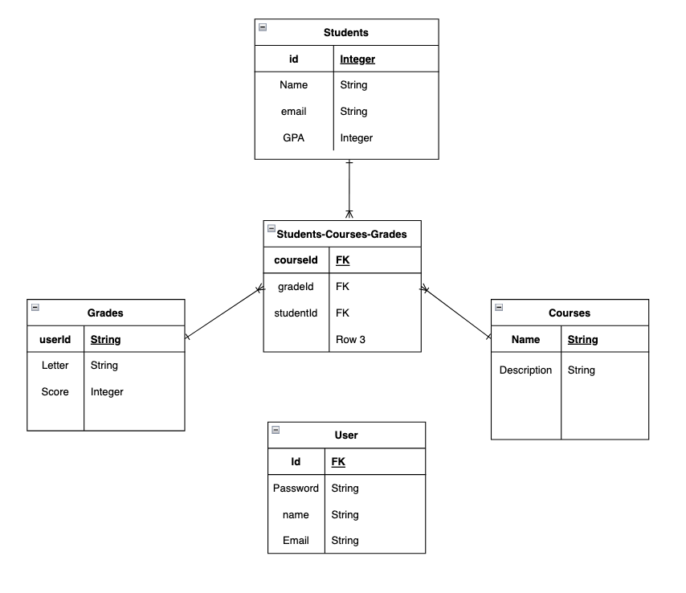
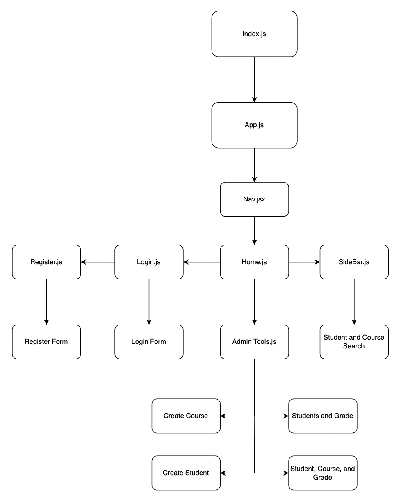

# school-report-backend
## Date 11/19/22
### By: [Fredy Laksmono](https://www.linkedin.com/in/fredy-laksmono/), [Jyotir McEwan-Anamoah](https://www.linkedin.com/in/jyotir-mcewan-anamoah-638b38183/), [Tyler Caillet](https://www.linkedin.com/in/tyler-caillet/)

#### [Github Fredy](https://github.com/fredy-laksmono) | [Github Jyotir](https://github.com/devopsjyotir) | [Github Tyler](https://github.com/tylercaillet)
#### [Project Trello](https://trello.com/b/AJO4a4SR/hackathon)

---

[App-TBA] | [Front-end GitHub](https://github.com/tylercaillet/school-report-frontend) | [Back-end GitHub](https://github.com/fredy-laksmono/school-report-backend)

---

### Description
School reporting app where teacher/admin can create/update/view their students,courses and grade.

***

### Technologies used

* HTML
* CSS
* PostgreSQL
* Sequelize
* Express
* React
* Node js

***

### Getting Started

***

### Planning
Wireframe   
[link](https://www.figma.com/file/sFjDwZ8pAwtRed7PH3ydWY/Wireframe-Kit-(Community)?node-id=12805%3A646&t=ThY4IK6GPmfJGau7-1)   
   
ERD   

CHD   

***

### Credits

PostgreSQL: [https://www.postgresql.org]   
Sequelize: [https://sequelize.org/]  
Express: [https://expressjs.com/]   
React:[https://reactjs.org/]   
NodeJs: [https://nodejs.org/en/]   
Redux: [https://redux.js.org/]    
